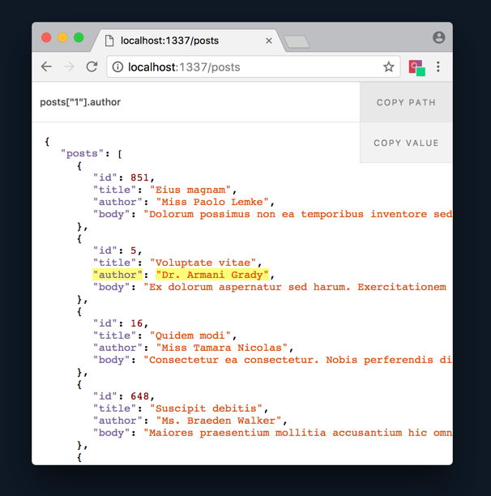
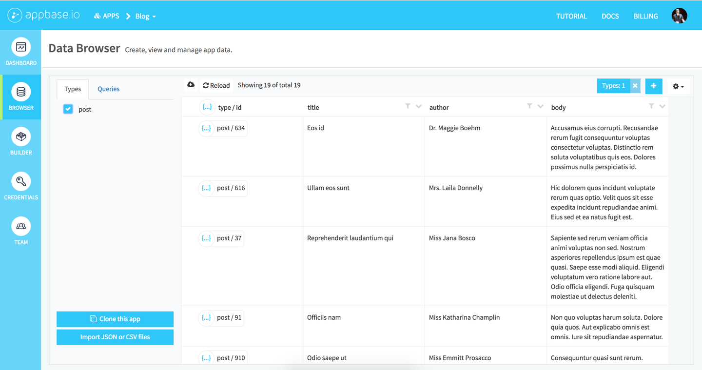
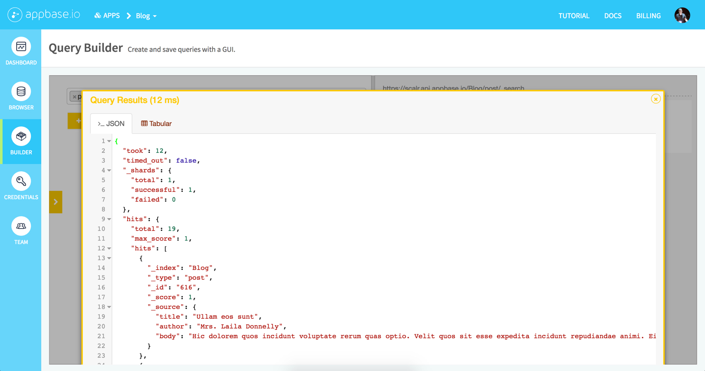
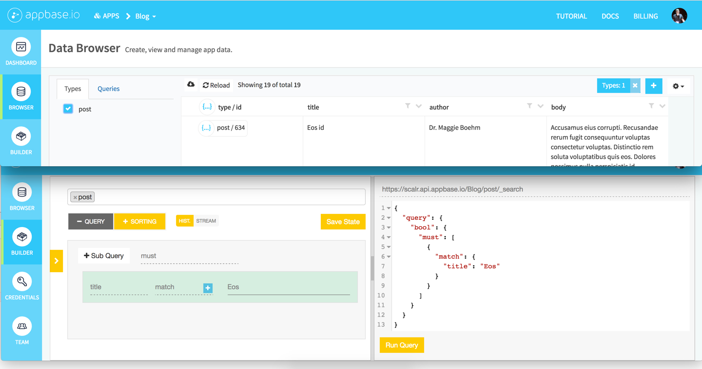

# Appbase Makes Streaming Data to React Apps Easy

[Appbase](https://appbase.io/) is streaming [ElasticSearch](https://www.elastic.co/guide/en/elasticsearch/guide/2.x/getting-started.html) in the cloud.

It makes saving, querying, and streaming data really easy.

Today we're going to:

1. Make a _really simple_ Express endpoint to generate dummy blog post JSON data using an npm package called [casual](https://github.com/boo1ean/casual).
2. Create a React button component to import that endpoint data to Appbase. We'll use the [appbase-js](http://docs.appbase.io/scalr/javascript/api-reference.html) library for this.
3. Browse that data using the [Appbase Dashboard](https://dashboard.appbase.io/apps) and a gentle introduction to ElasticSearch's [query language](https://www.elastic.co/guide/en/elasticsearch/reference/current/query-dsl.html).
4. Create a React component auto-update a streaming list of posts from Appbase.
5. Create a React component to use ElasticSearch's query language to search through our list of posts.
6. Sort our list of posts by their [ElasticSearch score](https://www.elastic.co/guide/en/elasticsearch/reference/current/query-filter-context.html) using [lodash](https://lodash.com/).

Sounds hard, but it should come in around a few hundred lines of code using [appbase-js](http://docs.appbase.io/scalr/javascript/api-reference.html).


## 1. Express Dummy JSON Endpoint

- `mkdir dummy-data`
- `cd dummy-data`
- `yarn add express cors casual nodemon`
  - [Express](https://expressjs.com/) for URL endpoint.
  - [cors](https://github.com/expressjs/cors) so we can fetch from anywhere.
  - [casual](https://github.com/boo1ean/casual) to generate random data simply.
  - [nodemon](https://github.com/remy/nodemon) to reload our Express server anytime we make changes to it (you might want to use your own data schema).

```js
// dummy-data/index.js

const express = require('express')
const app = express()
const cors = require('cors')
const casual = require('casual')

app.use(cors())

app.get('/posts', (req, res) => {
  const data = { posts: [] }

  for (let i = 0; i < 20; i++) { // Generating 20 blog posts data.
    data.posts.push({
      id: casual.integer(1, 1000), // Random number between 1-1000. It's unlikely we'll get duplicates, and this is just for demo purposes.
      title: casual.title, // Random blog post title.
      author: casual.name, // Random blog post author name.
      body: casual.text // Random paragraph of lipsum body text.
    })
  }

  res.json(data)
})

app.listen(1337, () => console.log(`Get your posts data at: http://localhost:1337/posts`))
```

```json
// dummy-data/package.json

{
  "scripts": {
    "start": "nodemon index"
  },
  "dependencies": {
    "casual": "^1.5.12",
    "cors": "^2.8.3",
    "express": "^4.15.2",
    "nodemon": "^1.11.0"
  }
}
```

That's it. Told you it was _really simple_.

Run `yarn start` to fire up your Express server.

Check out [http://localhost:1337/posts](http://localhost:1337/posts) for JSON in your browser.

I help with a side-project called [PickyJSON](https://chrome.google.com/webstore/detail/pickyjson/cdbfbhnfamigibakdbmmnihbpjldojgl) that makes viewing/selecting JSON in your browser a nicer experience.




## 2. React Button to Import 20 Dummy Blog Posts to Appbase

First things first, we need an Appbase app, so head over to [appase.io](https://appbase.io), Login, and create an app. I'm calling mine "Blog".

- `yarn add global create-react-app` A tool by Facebook to fire up a React dev project quickly.
- `create-react-app appbase-react-app`
- `cd appbase-react-app`
- `rm appbase-react-app/src/{App.css,App.js,index.css,logo.svg}` to delete all the create-react-app cruft.
- `mkdir components`
- `touch components/App.js`
- `yarn add axios`
- `yarn start` to fire up our React app at [http://localhost:3000](http://localhost:3000)

```js
// appbase-react-app/src/components/App.js

import React, {Component} from 'react'
import Appbase from 'appbase-js'
import axios from 'axios' // A nice promise-based AJAX library.

// We're including this here for the "import data to Appbase" functionality, but your write credentials should never live client-side.
// We'll go into securing your app with Express/Auth0 in the next tutorial.
const appbaseWriteRef = new Appbase({
  url: 'https://scalr.api.appbase.io',
  app: 'Blog',
  // You'll need your own credentials as these will be disabled when this article is published.
  credentials: '4YGjflpEg:2267ccf8-711f-493c-99b0-c430cbbf1a1c' // Dashboard > App > Credentials > "Admin API Key"
})

export default class App extends Component {
  addPostsToAppbase = e => {
    e.preventDefault()

    // Fetch dummy JSON using Axios.
    axios.get('http://localhost:1337/posts')
      .then(res => {
        // Map over each post object in the response array, writing to Appbase.
        res.data.posts.map(post => {
          // Docs on appbase-js' .index method.
          // http://docs.appbase.io/scalr/javascript/api-reference.html#javascript-api-reference-writing-data-index
          return appbaseWriteRef.index({
            type: 'post', // Should be singular.
            id: post.id, // Our document ID. It should be unique and is stored as a string.
            body: {
              title: post.title,
              author: post.author,
              body: post.body
            }
          })
          .on('error', err => console.error(err))
        })
      })
      .catch(err => console.error(err))
  }

  render() {
    return (
      <div>
        {/*
          Every time you click, you'll add 20 blog posts to your database.
          Clicking this multiple times will demonstrate the streaming functionality we'll add later.
        */}
        <button onClick={this.addPostsToAppbase} style={{padding: 10, cursor: 'pointer'}}>Add blog posts data to Appbase</button>
      </div>
    )
  }
}
```

```js
// appbase-react-app/src/index.js

import React from 'react'
import ReactDOM from 'react-dom'
import App from './components/App'

ReactDOM.render(<App />, document.querySelector('#root'))
```

Click the button to import 20 blog posts to Appbase.


## 3. The Appbase Dashboard and ElasticSearch Query-Builder

Head over to [https://dashboard.appbase.io](https://dashboard.appbase.io) and click "Browser" to see your data. If you were already browsing your app's data, you might need to refresh.



- Types, in ElasticSearch, can be thought of as SQL tables (except you handle relationships with [alternative queries](https://www.elastic.co/guide/en/elasticsearch/guide/current/relations.html)).
- Documents can be thought of like rows in a table.
- Document IDs are essentially primary keys and must be unique.

If you click on "Builder" you'll enter a query-builder where you can create custom queries for your data. Click on "Select types to apply query", you can select your `post` type. On the right side, you'll see the query needed to return all the documents associated with that type. Run it.



You should see some JSON containing all your documents.

Open another tab to browse your data for a string. In my case, the lipsum word _eos_ is in a post title.

In the query builder, I can click "+ Query", then "Field", "title", set "query" to `match`, and "Input" to `eos`.



Run your query. You should get something like this (assuming any matches were found):

```js
{
  // ElasticSearch metadata.
  "took": 1,
  "timed_out": false,
  "_shards": {
    "total": 1,
    "successful": 1,
    "failed": 0
  },
  "hits": {
    "total": 2,
    "max_score": 1.8106999,

    // An array of our matches!
    "hits": [
      {
        "_index": "Blog",
        "_type": "post",
        "_id": "634",
        // One of the most powerful features of ElasticSearch is that it returns a score instead of just a yes/no boolean on matches.
        // This means you can sort according to how close a match something is instead of arbitrarily. The higher the better.
        "_score": 1.8106999,
        "_source": {
          "title": "Eos id",
          "author": "Dr. Maggie Boehm",
          "body": "Accusamus eius corrupti. Recusandae rerum fugit consequuntur voluptas consectetur voluptas. Distinctio rem soluta voluptatibus quis eos. Dolores possimus nulla perspiciatis id."
        }
      },
      {
        "_index": "Blog",
        "_type": "post",
        "_id": "616",
        "_score": 1.44856,
        "_source": {
          "title": "Ullam eos sunt",
          "author": "Mrs. Laila Donnelly",
          "body": "Hic dolorem quos incidunt voluptate rerum quas optio. Velit quos sit esse expedita incidunt repudiandae animi. Eius sed et ea natus fugit est."
        }
      }
    ]
  }
}
```

This "score" thing is **really** crucial for any kind of modern search functionality. It will [intelligently/fuzzily guess](https://www.elastic.co/guide/en/elasticsearch/guide/current/fuzzy-matching.html) what someone is looking for instead of outright telling them, "No, we don't have any of that!"

Imagine you're a customer trying to look up "quick-dry paint" but you misspell it to "quik-dry paint". `quik` returns nothing, so the best `paint` matches appear first. Now you have to flip through several pages to find what you're looking for. But if you're using a powerful tool like ElasticSearch, `quik` is tested against `quick` and users will find exactly what they're looking for.

[Many, many, industry leaders](https://www.elastic.co/use-cases) use ElasticSearch for a lot, if not all, of their search functionality, but its query language is capable of much more.


## 4. Streaming Data from Appbase to Our React App

React re-renders _components_ when their props _change_, so let's stream to an array in state, then pass that state array to a `<Results />` component.

```js
// appbase-react-app/src/components/App.js

import React, {Component} from 'react'
import Appbase from 'appbase-js'
import axios from 'axios'

// Allows us to easily sort our results in asc or desc order. https://lodash.com/docs/4.17.4#orderBy
import orderBy from 'lodash.orderby'

// Import our newly created <Results /> component.
import Results from './Results'

// Let's use our read credentials to minimize coupling with the write credentials (which we'll be removing in a future tutorial).
const appbaseReadRef = new Appbase({
  url: 'https://scalr.api.appbase.io',
  app: 'Blog',
  credentials: 'JYPzM1j1I:26b31079-de99-4a62-86c6-28ae815397b5'
})

const appbaseWriteRef = new Appbase({
  url: 'https://scalr.api.appbase.io',
  app: 'Blog',
  credentials: 'FMLXCgtMj:db3b270b-85f2-4f3d-837b-b75cba864bd5'
})

export default class App extends Component {
  constructor() {
    super()

    this.state = {
      posts: []
    }
  }

  // We want to wait for the <App /> component to mount (initial markup/styles/scripts loaded on page) before trying to fill it with data.
  componentDidMount() {
    appbaseReadRef
      // Fetch up-to 1000 (maximum before you need to paginate) documents of the type 'post'.
      // http://docs.appbase.io/scalr/javascript/api-reference.html#javascript-api-reference-getting-data-search
      .search({
        type: 'post',
        size: 1000,
        body: {
          query: {
            // Returns every document within the given type.
            // https://www.elastic.co/guide/en/elasticsearch/reference/current/query-dsl-match-all-query.html
            match_all: {}
          }
        }
      })
      .on('data', res => {
        // console.log(res) // Uncomment this line to see what kind of JSON .search responds with.

        this.setState({
          // _id is a string, so we need to type-cast it to a Number.
          // orderBy is just ordering these by their _id in ASC order (smallest number first).
          posts: orderBy(res.hits.hits, o => Number(o._id), ['asc'])
        })
      })
      .on('error', err => console.error(err))

    appbaseReadRef
      // Open a stream of data from Appbase into this.state.posts
      .searchStream({
        type: 'post',
        body: {
          query: {
            match_all: {}
          }
        }
      })
      .on('data', res => {
        // console.log(res) // Uncomment this line to see what kind of JSON .searchStream responds with.

        this.setState({
          // ...this.state.posts expands to the contents of this.state.posts. So [1, 2, 3] would expand to 1, 2, 3.
          // Each item in the this.state.posts array is an object with an _id.
          // Then we wrap it in brackets to create a fresh array.
          posts: orderBy([res, ...this.state.posts], o => o._id, ['asc'])
        })
      })
      .on('error', err => console.error(err))
  }

  addPostsToAppbase = e => {
    e.preventDefault()

    axios.get('http://localhost:1337/posts')
      .then(res => {
        res.data.posts.map(post => {
          return appbaseWriteRef.index({
            type: 'post',
            id: post.id,
            body: {
              title: post.title,
              author: post.author,
              body: post.body
            }
          })
          .on('error', err => console.error(err))
        })
      })
      .catch(err => console.error(err))
  }

  render() {
    return (
      <div>
        <button onClick={this.addPostsToAppbase} style={{padding: 10, cursor: 'pointer'}}>Add blog posts data to Appbase</button>
        <br />
        {/* When this.state.posts changes, <Results /> will re-render (update itself with the new data). */}
        <Results posts={this.state.posts} />
      </div>
    )
  }
}
```

```js
// appbase-react-app/src/components/Results.js

import React from 'react'

// If we do {posts} here, we can bypass having to prefix posts with props.posts every time we need to use it.
// Not terribly helpful here, but a good little trick to know.
export default ({posts}) => {
  const listOfPosts = posts.map(post => {
    // Just making our variables a bit more readable using ES6 destructuring.
    const {_id} = post
    const {title, author, body} = post._source

    return (
      <article key={_id}>
        <header>
          <h1>{title}</h1>
          <p>
            <b>Post ID:</b> {_id}<br />
            <b>Written by:</b> {author}
          </p>
        </header>

        <div>{body}</div>

        <hr />
      </article>
    )
  })

  return <div>{listOfPosts}</div>
}
```

We just:

1. Got a list of all the posts already existing in the database using [`search()`](http://docs.appbase.io/scalr/javascript/api-reference.html#javascript-api-reference-getting-data-search)
2. Began streaming data to the `this.state.posts` array using [`searchStream()`](http://docs.appbase.io/scalr/javascript/api-reference.html#javascript-api-reference-streaming-data-searchstream)
3. When `this.state.posts` gets new data from Appbase, it causes `<Results />` to update itself.

You can test out that last point by manually adding some blog post data to Appbase using the Dashboard Browser. Click the + button in the top right, select the `post` type, manually fill in a document ID, the body should autofill.

Try small, or negative, numbers to see the top of your React app's `<Results />` update in realtime.
